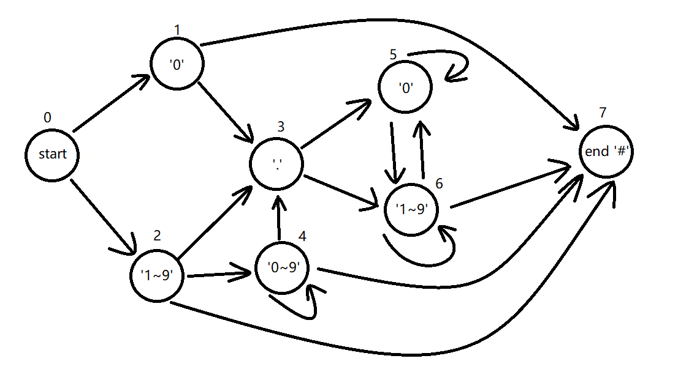

## 题目

[834. 模糊坐标](https://leetcode.cn/problems/ambiguous-coordinates/)


---


我们有一些二维坐标，如 `"(1, 3)"` 或 `"(2, 0.5)"`，然后我们移除所有逗号，小数点和空格，得到一个字符串`S`。返回所有可能的原始字符串到一个列表中。

原始的坐标表示法不会存在多余的零，所以不会出现类似于"00", "0.0", "0.00", "1.0", "001", "00.01"或一些其他更小的数来表示坐标。此外，一个小数点前至少存在一个数，所以也不会出现&ldquo;.1&rdquo;形式的数字。

最后返回的列表可以是任意顺序的。而且注意返回的两个数字中间（逗号之后）都有一个空格。

 

**示例 1:**
**输入:** "(123)"
**输出:** ["(1, 23)", "(12, 3)", "(1.2, 3)", "(1, 2.3)"]

**示例 2:**
**输入:** "(00011)"
**输出:**  ["(0.001, 1)", "(0, 0.011)"]
**解释:** 
0.0, 00, 0001 或 00.01 是不被允许的。

**示例 3:**
**输入:** "(0123)"
**输出:** ["(0, 123)", "(0, 12.3)", "(0, 1.23)", "(0.1, 23)", "(0.1, 2.3)", "(0.12, 3)"]

**示例 4:**
**输入:** "(100)"
**输出:** [(10, 0)]
**解释:** 
1.0 是不被允许的。

 

**提示: **

	- `4 <= S.length <= 12`.

	- `S[0]` = "(", `S[S.length - 1]` = ")", 且字符串 `S` 中的其他元素都是数字。


## 题解


### 思路



首先枚举逗号位置，将字符串分为两个子串a和b。
判断不添加和添加小数点后的a与b是否合法
对于合法的a和合法的b可以组成一对答案。

对于如何判断数是否合法，可以构造一个有限状态机判断。
对需要判断的数尾接一个`'#'`, 初始状态为0，当跑完后最后状态是7则成功，中途如果状态无法转移则跳到错误状态8。
举几个例子
`12.30#`
状态变化 
* `status=0`遇到`'1'`转为`status=2`
* `status=2`遇到`'2'`转为`status=2`
* `status=2`遇到`'.'`转为`status=3`
* `status=3`遇到`'3'`转为`status=6`
* `status=6`遇到`'0'`转为`status=5`
* `status=5`遇到`'#'`，无法转移，转为`status=8`

`0.12#`
状态变化 
* `status=0`遇到`'0'`转为`status=1`
* `status=1`遇到`'.'`转为`status=3`
* `status=3`遇到`'1'`转为`status=6`
* `status=6`遇到`'2'`转为`status=6`
* `status=6`遇到`'#'`转为`status=7`


### 代码


```cpp
class Solution {
public:
    int e[9][9] = {
        {0,1,1, 0,0,0, 0,0,1},
        {0,0,0, 1,0,0, 0,1,1},
        {0,0,0, 1,1,0, 0,1,1},

        {0,0,0, 0,0,1, 1,0,1},
        {0,0,0, 1,1,0, 0,1,1},
        {0,0,0, 0,0,1, 1,0,1},

        {0,0,0, 0,0,1, 1,1,1},
        {0,0,0, 0,0,0, 0,0,1},
        {0,0,0, 0,0,0, 0,0,1}
    };
    char lb[9] = {0, '0', '1', '.', '0', '0', '1', '#', 0};
    char ub[9] = {0, '0', '9', '.', '9', '0', '9', '#', 127};
    bool judge(string s) {
        s.push_back('#');
        int status = 0;
        for (int i=0; i<s.size(); i++) {
            for (int j=0; j<9; j++) {
                if (e[status][j] && lb[j] <= s[i] && s[i] <= ub[j]) {
                    status = j;
                    break;
                }
            }
        }
        // cout << s << " " <<  status << endl;
        return status == 7;
    }
    vector<string> ambiguousCoordinates(string s) {
        s.pop_back();
        s = s.substr(1);
        vector<string> ans;
        int n = s.size();
        for (int i=1; i<n; i++) {
            string a = s.substr(0,i), b = s.substr(i);
            // cout << a << " " << b << endl;
            vector<string> sta, stb;
            if (judge(a)) sta.push_back(a);
            if (judge(b)) stb.push_back(b);
            for (int j=1; j<a.size(); j++) {
                auto t = a; t.insert(t.begin()+j, '.');
                if (judge(t)) sta.push_back(t);
            }
            for (int j=1; j<b.size(); j++) {
                auto t = b; t.insert(t.begin()+j, '.');
                if (judge(t)) stb.push_back(t);
            }
            for (auto x:sta) for (auto y:stb) {
                ans.push_back("("+x+", "+y+")");
            }
        }
        return ans;
    }
};
```
